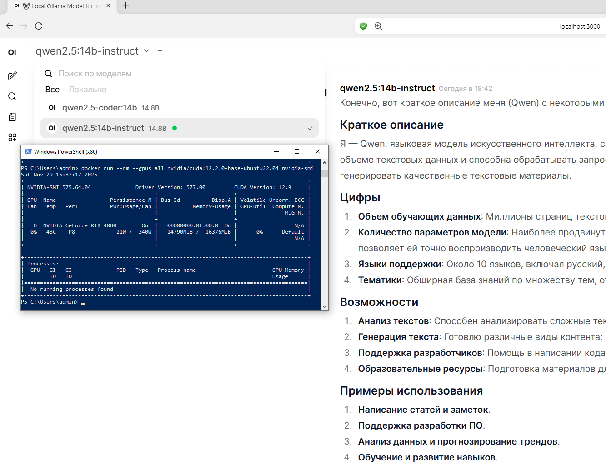

# Локальная среда Qwen2.5 (Ollama + Open WebUI)

[](LICENSE)
[](https://www.docker.com/)


[](https://ollama.com/)

Простая и удобная локальная среда для запуска моделей **Qwen2.5** (Instruct и Coder)  
полностью офлайн — через **Ollama** и **Open WebUI**, с использованием **NVIDIA GPU**.

---

## 📸 Скриншот рабочего окружения



---

# 1. Требования

## Аппаратные
- NVIDIA GPU от **12–16 GB VRAM**
- Рекомендуемые модели: **RTX 4070 / 4080 / 4090**

## Программные
- Docker Desktop (Windows/macOS) или Docker Engine (Linux)
- Драйвер NVIDIA
- CUDA Toolkit (Linux / RED OS)

---

# 2. Установка Docker (Windows)

1. Скачать Docker Desktop:  
   https://www.docker.com/products/docker-desktop/

2. При установке включить:
   - **WSL2 backend**  
   - **NVIDIA GPU Support**

3. Перезагрузить компьютер.

Проверить успешную установку:

```bash
docker --version
3. Проверка доступа к GPU в Docker
Выполните:

bash
Копировать код
docker run --rm --gpus all nvidia/cuda:12.2.0-base-ubuntu22.04 nvidia-smi
Если видна ваша RTX — GPU работает корректно.

4. Архитектура проекта
scss
Копировать код
Пользователь (браузер → http://localhost:3000)
                │
                ▼
            Open WebUI
                │
                ▼
               Ollama
                │
                ▼
 Qwen2.5 Models (14B Instruct / 14B Coder)
                │
                ▼
            NVIDIA GPU
5. docker-compose.yml
Файл docker-compose.yml:

yaml
Копировать код
services:
  ollama:
    image: ollama/ollama:latest
    container_name: ollama
    restart: unless-stopped
    ports:
      - "11434:11434"
    volumes:
      - ollama-data:/root/.ollama
    gpus: all

  open-webui:
    image: ghcr.io/open-webui/open-webui:main
    container_name: open-webui
    restart: unless-stopped
    depends_on:
      - ollama
    ports:
      - "3000:8080"
    environment:
      - OLLAMA_BASE_URL=http://ollama:11434
    volumes:
      - open-webui-data:/app/backend/data

volumes:
  ollama-data:
  open-webui-data:
6. Запуск проекта
Перейти в каталог проекта:

bash
Копировать код
cd local-claude-qwen2.5
Запустить сервисы:

bash
Копировать код
docker compose up -d
Проверить:

bash
Копировать код
docker ps
Открыть интерфейс:

arduino
Копировать код
http://localhost:3000
7. Установка моделей Qwen2.5
Перейти в контейнер Ollama:

bash
Копировать код
docker exec -it ollama bash
Установить основную модель:

bash
Копировать код
ollama pull qwen2.5:14b-instruct
Установить модель для программирования:

bash
Копировать код
ollama pull qwen2.5-coder:14b
8. Характеристики моделей
Qwen2.5:14B Instruct
Параметры: 14.8B

Контекст: 32768 токенов

Квантовка: Q4_K_M

Размер модели: ≈ 9 GB

VRAM при работе: ≈ 8–10 GB

Назначение: диалоги, рассуждения, обучение

Qwen2.5:14B Coder
Параметры: 14.8B

Квантовка: Q4_K_M

Размер: ≈ 9 GB

VRAM: ≈ 8–10 GB

Назначение: генерация и анализ кода

9. Квантовка (Q4_K_M)
Формат	Битность	Память	Качество
FP16	16-bit	Очень высокая	Максимальное
INT8	8-bit	Высокая	Хорошее
Q4_K_M	4-bit	Минимальная	Почти как FP16

Q4_K_M — лучший баланс для RTX 4070/4080/4090.

10. Выбор модели в Open WebUI
В Model Selector выберите:

qwen2.5:14b-instruct

qwen2.5-coder:14b

11. Рекомендуемый System Prompt (Coder)
В Open WebUI → Параметры чата → System Prompt:

Копировать код
Ты — профессиональный AI-программист.
Пишешь структурированный и компилируемый код.
Не придумываешь несуществующих библиотек.
Если данных недостаточно — задаёшь уточняющие вопросы.
Разделяешь код по файлам.
Работаешь строго и технически грамотно.
12. Управление контейнерами
Остановить:

bash
Копировать код
docker compose down
Запустить:

bash
Копировать код
docker compose up -d
Перезапуск:

bash
Копировать код
docker compose restart
13. Дополнительные модели
Лёгкая Instruct модель:

bash
Копировать код
ollama pull qwen2.5:7b-instruct
Лёгкий Coder:

bash
Копировать код
ollama pull qwen2.5-coder:7b
14. Установка на RED OS
Установить Docker:

bash
Копировать код
sudo dnf install docker
Настроить NVIDIA Runtime:

bash
Копировать код
sudo nvidia-ctk runtime configure --runtime=docker
Перезапустить Docker:

bash
Копировать код
sudo systemctl restart docker
Разрешить порты:

bash
Копировать код
sudo firewall-cmd --add-port=3000/tcp --permanent
sudo firewall-cmd --add-port=11434/tcp --permanent
sudo firewall-cmd --reload
15. Credits
Проект создан на основе:

Ollama — локальный движок LLM
https://ollama.com/

Open WebUI — frontend для LLM
https://github.com/open-webui/open-webui

16. Лицензия
Распространяется по лицензии MIT.
Полный текст — в файле LICENSE.
